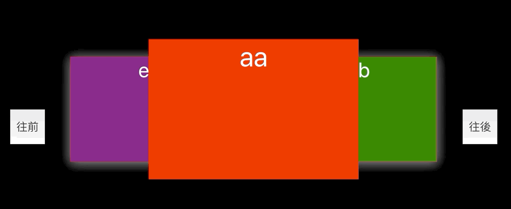

# 15F - 死亡筆記本

20191007


[UI設計稿](https://xd.adobe.com/spec/ab354ac3-8cd5-4956-6b2a-236f45b381ca-dd04/)

參考：
[來寫個無限手套的分解特效吧](https://medium.com/chris-chuang/%E4%BE%86%E5%AF%AB%E5%80%8B%E7%84%A1%E9%99%90%E6%89%8B%E5%A5%97%E7%9A%84%E5%88%86%E8%A7%A3%E7%89%B9%E6%95%88%E5%90%A7-908d80792d85)
[ngx-thanos](https://github.com/wellwind/ngx-thanos/blob/a993907c25d4983dbeeccc3eb539e02923c1623d/libs/thanos-snap/src/lib/thanos-snap.ts)
[Thanos Snap Effect JavaScript Tutorial](https://redstapler.co/thanos-snap-effect-javascript-tutorial/)

---

## # 輪播圖片的實作

我們先簡單的實現出來，效果如下


實現的想法是因為畫面上只會看到三張。    
我設定在最前面的class是"main"，它的左邊是"left"，右邊是"right"，其他的都看不到，就叫"bak"    
然後所有照片的位置相對於外層"slider"都是`position: absolute;`，再透過`transform`來調整效果

```html
<div class="slider">
  <div class="photo1 main">aa</div>
  <div class="photo2 right">bb</div>
  <div class="photo3 bak">cc</div>
  <div class="photo4 bak">dd</div>
  <div class="photo5 left">ee</div>
</div>
```

```scss
div[class^="photo"] {
  width: 600px;
  height: 400px;
  position: absolute;
  .main {
    z-index: 4;
  }
  .left {
    z-index: 3;
    transform: translate(-50%, 0) scale(.75);
    box-shadow: 0px 4px 40px #FFFFFF80;
  }
  .right {
    z-index: 3;
    transform: translate(50%, 0) scale(.75);
    box-shadow: 0px 4px 40px #FFFFFF80;
  }
  .bak {
    transform: scale(0.5);
    opacity: 0.5;
  }
}
```


不過因為我們的照片是一個陣列`['aa', 'bb', 'cc', 'dd', 'ee']`     
我們要讓他有環狀的概念    
在"main"是第一張`aa`的時候，它的"left"應該要是第五張`ee`，在第五張`ee`，他的"right"應該要是第一張`aa`    

```js
if (mainPhotoIndex === 0) {
  // 它的左邊是陣列的最後一張
  if (photoIndex === photoList.length - 1) {
    return 'left';
  }
}
// 最後一張在中間的話
if (mainPhotoIndex === photoList.length - 1) {
  // 它的右邊是陣列的第一張
  if (photoIndex === 0) {
    return 'right';
  }
}
```

再來是點擊往前往後的時候，如果碰到陣列第一張和最後一張，也要別處理
```js
  const handlePrev = () => {
    // 已經是第一個了，就回到最後一個
    if (mainPhotoIndex === 0) {
      setmainPhotoIndex(photoList.length - 1);
    } else {
      setmainPhotoIndex(mainPhotoIndex - 1);
    }
  }
  const handleNext = () => {
    // 已經是最後一個了，就回到第一個
    if (mainPhotoIndex === photoList.length - 1) {
      setmainPhotoIndex(0);
    } else {
      setmainPhotoIndex(mainPhotoIndex + 1);
    }
  }
```

然後切換的時候，希望動畫可以平滑，可以使用
```scss
{
  transition: all 0.4s ease-in-out;
}
```

## # Thanos(薩諾斯)效果    

## # 要把圖片畫到canvas，高度一直是0

圖片的css是根據parent div的寬高來調整，當圖片沒有加載完成的時候，拿到的高度一直都是0    
```scss
    img {
      width: 100%;
      height: auto;
    }
```

加了onload後，就可以順利取得高度了     

```jsx
  useEffect(() => {
    if (!imgEl.current) {
      console.error("沒有imgEl")
      return;
    }
    if (!canvasEl.current) {
      console.error("沒有canvasEl")
      return;
    }
    const img: HTMLImageElement = imgEl.current;
    const canvas: HTMLCanvasElement = canvasEl.current;
    const ctx: CanvasRenderingContext2D = canvas.getContext('2d')!;
    console.log("圖片還沒加載完成",img.getBoundingClientRect())
    // 要等到圖片加載完成再畫到canvas上
    img.onload = (() => {
      console.log("圖片加載完成，可以拿到寬高",img.getBoundingClientRect())
      // 設定canvas和image一樣大
      canvas.width = img.width;
      canvas.height = img.height;
      // 在canvas上面把圖片畫上去
      ctx.drawImage(img, 0, 0, img.width, img.height);
    })
  });
```


參考：[圖片到底載入了沒？](http://otischou.tw/notes/2017/01/01/detect-is-image-loaded.html)


## # ctx.getImageData(sx, sy, sw, sh)

getImageData()會return ImageData實例，它可以取得指定區域內的像素數據

ImageData的data屬性中，可以看到每個像素的信息，也就是RGBA

R - 紅色 (0-255)
G - 綠色 (0-255)
B - 藍色 (0-255)
A - alpha 通道 (0-255)

```js
red=imgData.data[0];
green=imgData.data[1];
blue=imgData.data[2];
alpha=imgData.data[3];
```

跟getImageData()相對的是putImageData()，我們可以修改完像素資料後，再用putImageData()畫回canvas

## # createImageData() 可以創造一個全新空白的ImageData 物件
可以使用createImageData()方法創造一個全新空白的ImageData 物件。


可完這個[例子](https://www.w3school.com.cn/html5/canvas_createimagedata.asp)，我就懂createImageData()要幹嘛了

```js
var c=document.getElementById("myCanvas");
var ctx=c.getContext("2d");
// 建立一個100*100的ImageData Instance
var imgData=ctx.createImageData(100,100);
// 像素資料是rgba，所以每四個為一組
for (var i=0;i<imgData.data.length;i+=4) {
  // 做出綠色
  imgData.data[i+0]=255;
  imgData.data[i+1]=0;
  imgData.data[i+2]=0;
  imgData.data[i+3]=255;
}
// 畫回canvas
ctx.putImageData(imgData,10,10);
```

參考 https://developer.mozilla.org/zh-TW/docs/Web/API/Canvas_API/Tutorial/Pixel_manipulation_with_canvas
